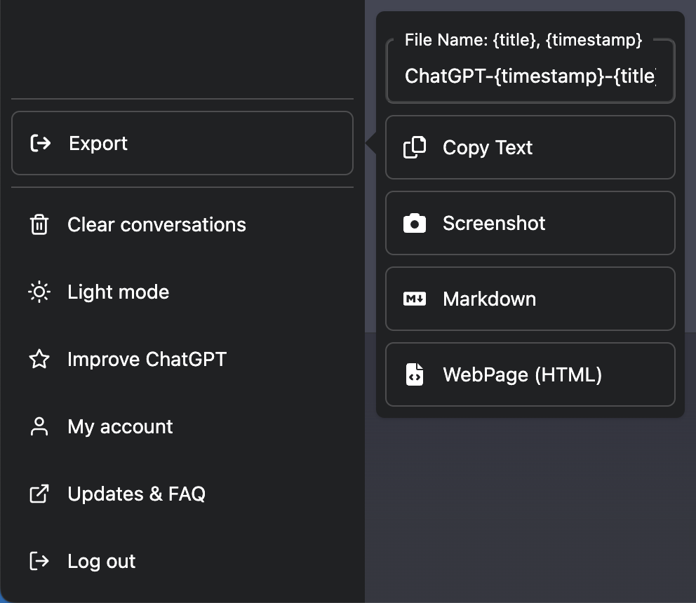

> **Historical note:** This post describes ChatGPT and a workaround I used in February 2023. I've kept it as a record of that experience; the interface and installation instructions may no longer match what's available today.

As of February 2023, the ChatGPT interface is **extremely** basic. The missing feature that bothers me most is chat exports.

I like to label my chats by what I'm working on. Once I'm done, I want to clear them out of the sidebar without losing the conversation.

The only way to achieve this today, however, is by deleting the chat.

That’s a no-go for me!

I’d like to be able to store that chat somewhere, so I can reference it in future.

Well, thanks to this handy script with Tampermonkey, now I can:

## Enter Tampermonkey

[Tampermonkey](https://www.tampermonkey.net/) is a browser extension that runs scripts to add features or change how a website behaves. In this case, it lets me add an export button to ChatGPT without waiting for the app to support it.

Scripts can access data on the pages where they run, so check the source and permissions before installing one, especially on a page containing private conversations.

## ChatGPT Exporter

Onto the topic at hand.

[ChatGPT Exporter](https://github.com/pionxzh/chatgpt-exporter) is the script I used. Thanks to [pionxzh](https://github.com/pionxzh) for putting it together.

The installation isn’t seamless, unfortunately, as the Tampermonkey UI could use a little 2023 love, but it is luckily very straightforward:

1. Install Tampermonkey on your browser ([Chrome](https://chrome.google.com/webstore/detail/dhdgffkkebhmkfjojejmpbldmpobfkfo), [Edge](https://microsoftedge.microsoft.com/addons/detail/iikmkjmpaadaobahmlepeloendndfphd), [Safari](https://apps.apple.com/us/app/tampermonkey/id1482490089), [Opera](https://addons.opera.com/en/extensions/details/tampermonkey-beta/) & [Firefox](https://addons.mozilla.org/en-US/firefox/addon/tampermonkey/))
2. Navigate to the [ChatGPT Exporter page on GreasyFork](https://greasyfork.org/en/scripts/456055-chatgpt-exporter)
3. Hit the Install button, and **wait for 10–15 seconds** (important)
4. To confirm it’s been installed correctly, click on Tampermonkey and navigate to the Dashboard: you should see it installed and enabled.

Step 3 tripped me up initially, as when I clicked the Install button, nothing happened. I assumed it didn’t work and ended up manually copying and pasting the code into Tampermonkey.

You should now be able to export your chats as a screenshot, text, markdown, or HTML. My personal preference is Markdown, as it’s the easiest to work with and can easily be converted into other formats.

For now, this lets me clear the sidebar without throwing away conversations I want to keep.
